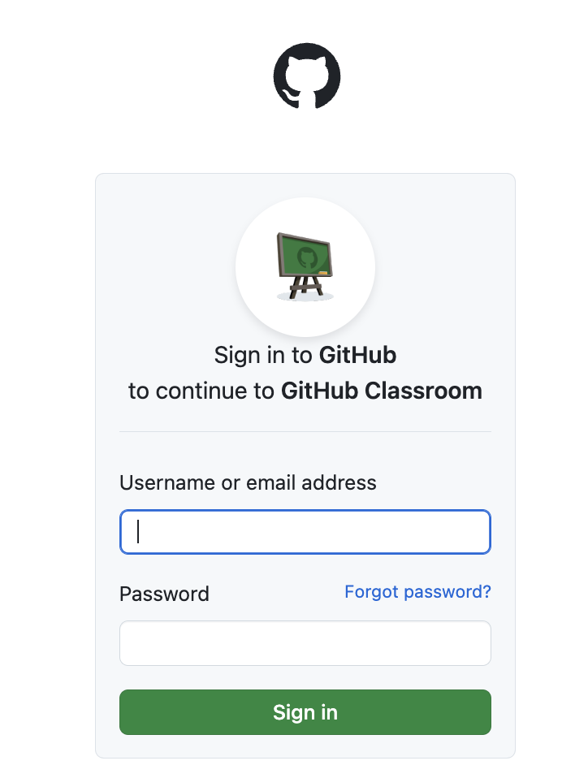

### Git and GitHub

Git is a version control software that allows you to view changes to files over time, revert to earlier versions of files, and save new versions and changes. GitHub is a website for storing work which supports Git version control features. On GitHub, for example, you can easily see edits to each file in a repository, compare different versions of code over time, and manage branches and contributors to large projects. 

A good analogy is to think of Git working like the track changes feature in Word, but with a lot more options, control, and features. GitHub then functions like Box or DropBox, hosting your files remotely and allowing others to access and (possibly) edit them. While Git allows you to perform version control locally on your files, GitHub allows you to share files and edits with others. 

Git and GitHub are widely used in both industry and academia for collaboration and sharing code. In this course, we will use them to submit code for assignments. I have created a GitHub Classroom for this course, which will allow me to share assignment repositories and starter code with you. Your workflow will be to:

1. Accept assignment invitations, creating a new repository on GitHub for each of your assignments
2. Clone the assignment repository to your local machine
3. As you complete the assignment on your local machine, you will commit and push your changes to the remote repository on GitHub
4. Once you have finished the assignment and pushed to GitHub, you will request and receive feedback from me through GitHub

Full details on these steps is provided below.

### Initial setup: R + RStudio + Git + GitHub

Before completing your first assignment, you will need to get all of your software set up and talking to each other. This means that you will need to install R and RStudio (if they are not already installed, or update them if needed), install Git, set up a GitHub account, and connect Git, GitHub, and RStudio. For the Git and GitHub setup, and the connection with RStudio, see the book [Happy Git and GitHub for the useR](https://happygitwithr.com/). 

1. Install or update R and RStudio; see the [R and RStudio installation instructions](https://sta379-s25.github.io/resources/software_installation/) on the course website, and [Chapter 5](https://happygitwithr.com/install-r-rstudio) of Happy Git with R. If you have not updated your versions of R and RStudio in a while, make sure to do so at the beginning of this course!
2. Set up a GitHub account, if you don't already have one from a previous course. See [Chapter 4](https://happygitwithr.com/github-acct) of Happy Git with R.
3. Install and setup Git on your machine; see [Chapter 6](https://happygitwithr.com/install-git) and [Chapter 7](https://happygitwithr.com/hello-git) of Happy Git with R. Chapter 8 also discusses options for Git clients to make interacting with Git locally on your computer easier / more visual. You can safely skip Chapter 8 (we will work with a curated subset of Git functionality in this course, so a client is probably not necessary for your Git interactions), but you are more than welcome to install and use one if you like.
4. Set up credentials for interacting with GitHub; see [Chapter 9](https://happygitwithr.com/https-pat) of Happy Git with R. (You could use the SSH approach in Chapter 10, but I highly recommend the HTTPS approach presented in Chapter 9).

Once these initial steps are complete, proceed to the next section below, which describes the steps for joining the GitHub Classroom and completing your first assignment.

### Your first assignment through GitHub

This section describes the steps for accepting and submitting your first assignment on GitHub Classroom. The first time you do this, you will also join the GitHub Classroom for this course. To give you practice with these steps, I have created an **example assignment** which you can submit, and which I will walk you through in detail in this section, but which has no stakes and is not graded. For future assignments (homeworks, challenges, projects), your workflow will be very similar, with the difference that you will not need to re-join the classroom, and the specific assignment and repository names will change.

#### Step 1: Open the assignment link

Go to Canvas. Under Assignments, click on *Example assignment (ungraded)*. Click on the GitHub Classroom link provided in the assignment description.

#### Step 2: Log in to GitHub

If you are not already logged in, GitHub will prompt you to log in to your account:

