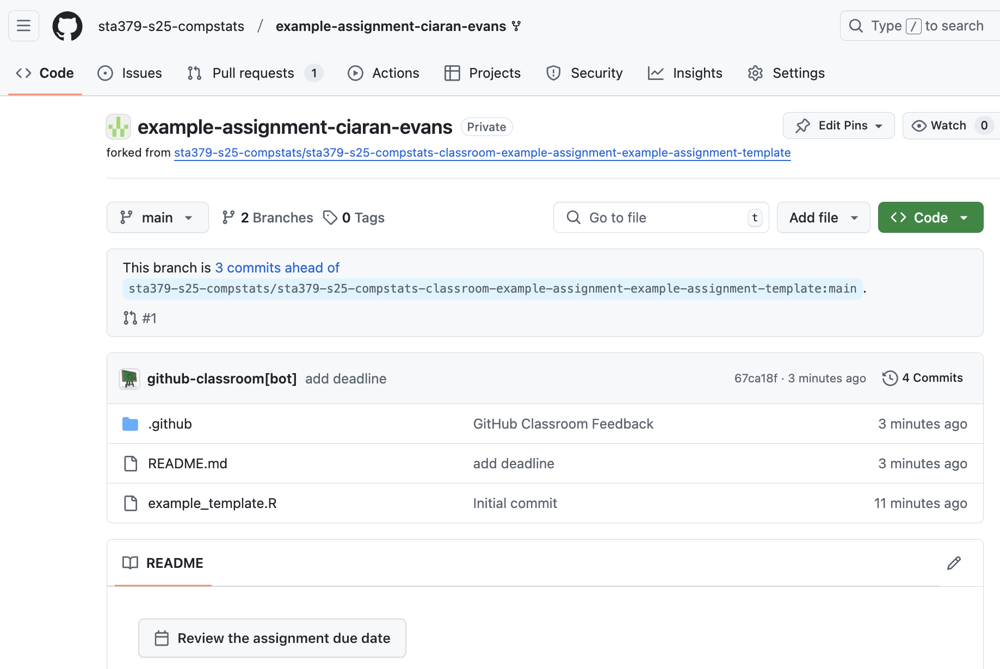

### Git and GitHub

Git is a version control software that allows you to view changes to files over time, revert to earlier versions of files, and save new versions and changes. GitHub is a website for storing work which supports Git version control features. On GitHub, for example, you can easily see edits to each file in a repository, compare different versions of code over time, and manage branches and contributors to large projects. 

A good analogy is to think of Git working like the track changes feature in Word, but with a lot more options, control, and features. GitHub then functions like Box or DropBox, hosting your files remotely and allowing others to access and (possibly) edit them. While Git allows you to perform version control locally on your files, GitHub allows you to share files and edits with others. 

Git and GitHub are widely used in both industry and academia for collaboration and sharing code. In this course, we will use them to submit code for assignments. I have created a GitHub Classroom for this course, which will allow me to share assignment repositories and starter code with you. Your workflow will be to:

1. Accept assignment invitations, creating a new repository on GitHub for each of your assignments
2. Clone the assignment repository to your local machine
3. As you complete the assignment on your local machine, you will commit and push your changes to the remote repository on GitHub
4. Once you have finished the assignment and pushed to GitHub, you will request and receive feedback from me through GitHub

Full details on these steps is provided below.

### Initial setup: File system + R + RStudio + Git + GitHub

Before completing your first assignment, you will need to get all of your software set up and talking to each other. This means that you will need to install R and RStudio (if they are not already installed, or update them if needed), install Git, set up a GitHub account, and connect Git, GitHub, and RStudio. For the Git and GitHub setup, and the connection with RStudio, see the book [Happy Git and GitHub for the useR](https://happygitwithr.com/). You should also prepare a folder on your local computer that you will use for your classwork in 379 this semester.

1. Create a folder on your local computer to store your work in this class. I would recommend calling it something like `sta379-s25-work`, and saving it somewhere permanent and accessible (NOT your Downloads folder, e.g.). For example, on my computer I created the folder `~/Documents/sta379-s25-work` (storing it under Documents). When you later accept assignments through GitHub Classroom, you should store them in this folder, with a subdirectory for each assignment.
2. Install or update R and RStudio; see the [R and RStudio installation instructions](https://sta379-s25.github.io/resources/software_installation/) on the course website, and [Chapter 5](https://happygitwithr.com/install-r-rstudio) of Happy Git with R. If you have not updated your versions of R and RStudio in a while, make sure to do so at the beginning of this course!
3. Set up a GitHub account, if you don't already have one from a previous course. See [Chapter 4](https://happygitwithr.com/github-acct) of Happy Git with R.
4. Install and setup Git on your machine; see [Chapter 6](https://happygitwithr.com/install-git) and [Chapter 7](https://happygitwithr.com/hello-git) of Happy Git with R. Chapter 8 also discusses options for Git clients to make interacting with Git locally on your computer easier / more visual. You can safely skip Chapter 8 (we will work with a curated subset of Git functionality in this course, so a client is probably not necessary for your Git interactions), but you are more than welcome to install and use one if you like.
5. Set up credentials for interacting with GitHub; see [Chapter 9](https://happygitwithr.com/https-pat) of Happy Git with R. (You could use the SSH approach in Chapter 10, but I highly recommend the HTTPS approach presented in Chapter 9).

Once these initial steps are complete, proceed to the next section below, which describes the steps for joining the GitHub Classroom and completing your first assignment.

### Your first assignment through GitHub

This section describes the steps for accepting and submitting your first assignment on GitHub Classroom. The first time you do this, you will also join the GitHub Classroom for this course. To give you practice with these steps, I have created an **example assignment** which you can submit, and which I will walk you through in detail in this section, but which has no stakes and is not graded. For future assignments (homeworks, challenges, projects), your workflow will be very similar, with the difference that you will not need to re-join the classroom, and the specific assignment and repository names will change.

#### Step 1: Open the assignment link

Go to Canvas. Under Assignments, click on *Example assignment (ungraded)*. Click on the GitHub Classroom link provided in the assignment description.

#### Step 2: Log in to GitHub

If you are not already logged in, GitHub will prompt you to log in to your account:

#### Step 3: Join the Classroom (only needs to be done once!)

The first time you click on an assignment link, GitHub will ask you to join the GitHub Classroom for the course (`sta379-s25-compstats-classroom`). Click on your email address from the list of identifiers. **Important:** Once you click on an identifier, GitHub will link your account to that email address. Do not click on anyone else's email, only your own!

#### Step 4: Accept the assignment

You will now be prompted to accept the assignment (in this case, `example-assignment`). This will give you access to a new repository on GitHub called `example-assignment-USERNAME` (e.g., `example-assignment-ciaran-evans`). Click the green "Accept this assignment" button.

Once you have accepted the assignment, you will be taken to the assignment repository on GitHub (e.g., `example-assignment-ciaran-evans`). In the example assignment, there are two files already in the repository: `README.md` provides some information about the assignment (short because full assignment instructions are on the course website), and `example_template.R` provides an R script with starter code.

If you click on the `example_template.R` file, for example, you will see an incomplete R function for calculating the mean, called `my_mean`. In most assignments, you will have one or more .R files, containing starter code and unit tests. Assignments involving C++ will also have one or more `.cpp` starter files.

#### Step 5: Clone the repository to your local computer

Click the green "Code" button, and select HTTPS. You will see a web URL that you can copy to the clipboard:

Click the icon next to this URL to copy it to the clipboard

Now open RStudio, and click *File* -> *New Project*. This will open the new project wizard. Select *Version Control*

Then select *Git*

The project wizard will then ask for Git repository info. 

* Paste the URL you copied from GitHub into the "Repository URL" field. 
* Under "Project directory name:", enter the assignment name (e.g., `example-assignment`). 
* Under "Create project as subdirectory of:", browse and select the folder on your local computer that you created for your work in this class (e.g., `Documents/sta379-s25-work`). 
* Select "Open in new session"
* Then click "Create Project".

This will clone the repository from GitHub to your local computer, and will create a new R project in that repository. This project will then be opened as a new RStudio session on your computer. In the new RStudio session, click the Files viewer (next to Plots, in one of the four panes). You should see the files for the example assignment repository:

#### Step 6: Pull

In one of the panes on RStudio, you should see a *Git* tab, which has the Git tools (pull, staging, commit, and push) that we will use to save work and interact with GitHub:

Before doing work in the repository, pull from the remote GitHub repository (click the "Pull" arrow, pointing down). Try to make this a habit whenever you start work on an assignment, or go back to an assignment you have worked on previously. If you are the only one making changes to a repository, and you are only using one computer, then it won't really matter, but it is still a good habit for the future. However, if you are working on the same code across multiple computers, or collaborating with other people, then pulling first is very important!

Because nothing has changed on the remote repository, you will get a message saying everything is up to date:

